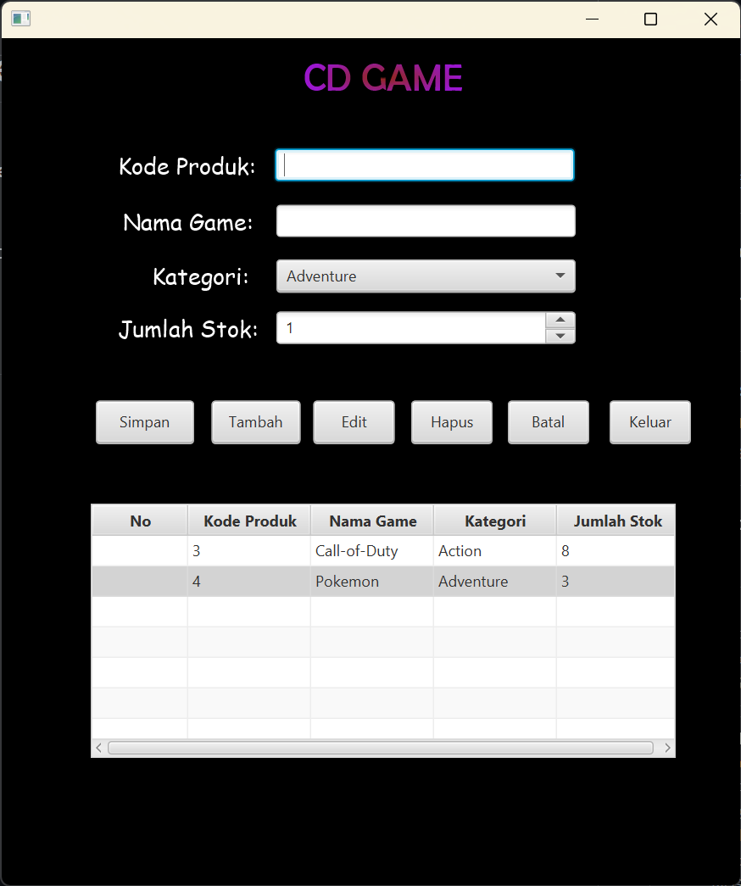
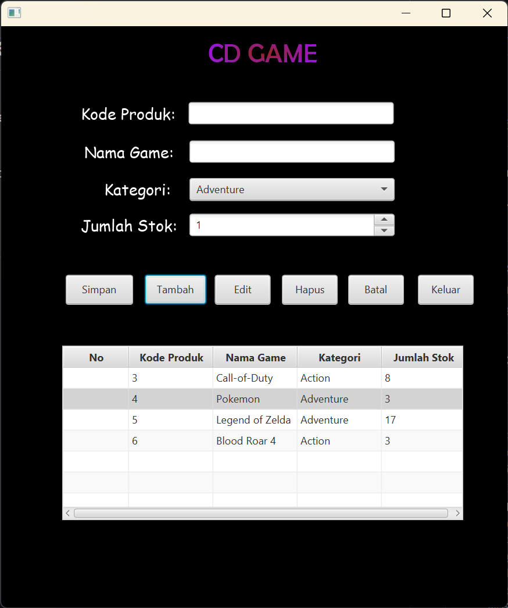
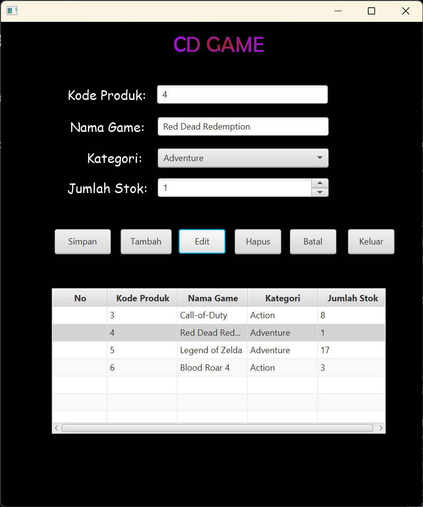
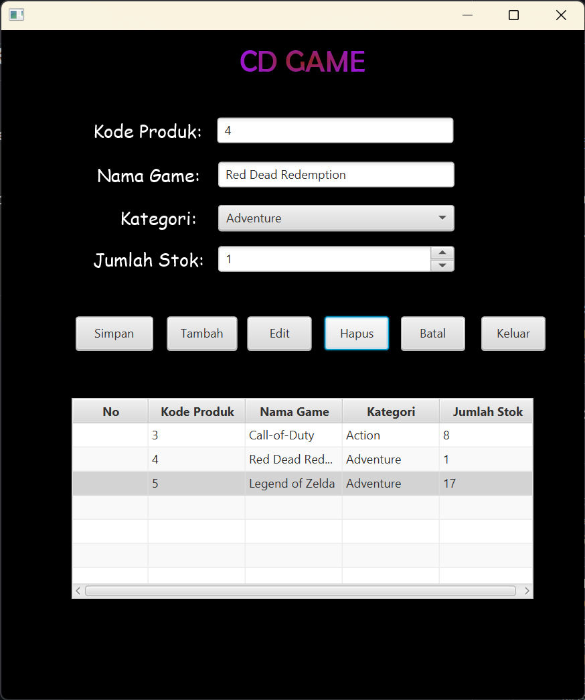

# Sistem Penyewaan CD Game

A desktop-based **CD Game Rental Management System** developed using **Java and JavaFX** in **Eclipse IDE**. This project was created to implement fundamental **CRUD (Create, Read, Update, Delete)** operations through a graphical user interface.

The application allows users to manage game inventory data, including the game code, game name, category, and available stock.

## Screenshots

### Main Interface



### Adding Inventory



### Editing Inventory



### Deleting Inventory



## Features

* **Create** — Add new game inventory records.
* **Read** — Display stored game data using a JavaFX `TableView`.
* **Update** — Edit existing game information.
* **Delete** — Remove selected game records.
* **Category Selection** — Choose game categories such as Adventure, Action, RPG, and Strategy.
* **Stock Management** — Manage game stock using a JavaFX `Spinner`.
* **Local Data Persistence** — Game data is saved locally using Java object serialization and loaded automatically when the application starts.
* **JavaFX GUI** — Interactive desktop interface built with JavaFX components and FXML.

## Technologies Used

* **Java**
* **JavaFX**
* **FXML**
* **Eclipse IDE**
* **Java Object Serialization**

## Data Storage

This project does not use an external database such as MySQL. Instead, application data is stored locally in a serialized file:

```text
orderData.ser
```

The application uses Java's `ObjectOutputStream` to serialize and save the inventory data, while `ObjectInputStream` is used to load the data when the application starts.

This approach demonstrates basic **data persistence** without requiring a separate database server.

## Project Structure

The project follows a simple JavaFX application structure:

* **Controller** — Handles user interactions and CRUD operations.
* **Model (`Order`)** — Represents game inventory data.
* **FXML** — Defines the graphical user interface.
* **Serialized Data File** — Stores application data locally.

## CRUD Workflow

The application provides a simple inventory management workflow:

1. Enter the game code and game name.
2. Select the game category.
3. Set the available stock.
4. Click **Tambah** to create a new record.
5. Select an existing record from the table to edit or delete it.
6. Changes are saved automatically to the local data file.
7. Existing records are loaded automatically when the application starts.

## Purpose

This project was developed as a practical implementation of **Object-Oriented Programming, JavaFX GUI development, event handling, CRUD operations, and local data persistence**.

It demonstrates how a Java desktop application can manage structured inventory data through a graphical user interface without relying on an external database.
